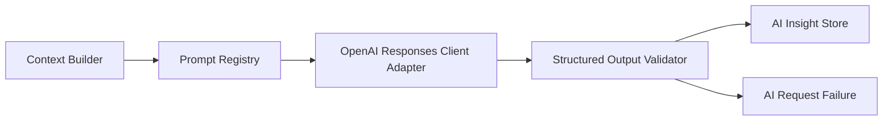

# AI Sidecar Architecture

## Purpose

The ChatGPT/OpenAI Sidecar is a read-only analysis assistant for `suseok-trader-v2`.
It helps the operator understand market context, candidate blocks, no-trade sessions,
trade reviews, operational incidents, and Codex prompt drafts.

The Sidecar is not a trading engine. It does not create `OrderIntent`, does not create
`GatewayCommand`, and does not call or connect to `send_order`, `cancel_order`, or
`modify_order`.

## Boundaries

Core owns configuration, API routing, storage initialization, and system status.
Strategy owns deterministic candidate evaluation. Risk owns deterministic risk checks.
OMS owns order lifecycle behavior in later PRs. Gateway owns broker transport isolation.

The Sidecar sits outside those decision paths. PR AI-1 adds a bounded, sanitized context
builder that reads Event Store and projection state for operator preview. PR AI-2 adds a
manual, optional structured-output execution layer. Strategy, Risk, and OMS must not use
Sidecar output as automatic decision input.

## Read-only Principles

- Sidecar output is for Dashboard, Report, Operator Review, and Codex Prompt Draft
  surfaces only.
- Sidecar output cannot change strategy thresholds, risk limits, trading mode, live
  flags, or position sizes.
- Sidecar output cannot enqueue, submit, cancel, or modify orders.
- Every Sidecar output must pass schema validation before it can be stored as an
  insight.
- Validation failures must not produce normal insights. They may be rejected or
  recorded only with an invalid-output status such as `AI_OUTPUT_INVALID`.
- The default Sidecar posture is disabled.

## Context Builder

PR AI-1 adds `AISidecarContextPacket` and a read-only Context Builder. The builder is not
an OpenAI client and does not create insights. It creates bounded, redacted, deterministic,
schema-versioned packets for:

- Daily market brief
- Theme brief
- Candidate block RCA
- No-trade RCA
- Trade review placeholder context
- Operations incident summary
- Codex prompt context

Context packets enforce size limits, secret/path/account redaction, and order-context
restriction. `persist=true` stores the final packet in `ai_context_packets` for audit only.

## Event Store Analysis Shape

The AI-2 Sidecar flow is:

1. Deterministic services write market, candidate, risk, OMS, Gateway, and ops events.
2. The Context Builder creates a bounded read-only packet for one allowed Sidecar task.
3. The Prompt Registry builds a read-only system/user prompt from the redacted payload.
4. The OpenAI Responses client adapter sends strict JSON Schema structured output metadata.
5. The runner validates the model output locally against the task schema and domain policy.
6. Valid insights are stored for read-only display.
7. Invalid, timed out, or errored runs are recorded as failures without insight storage.

This path is manual-only. There is no background worker, no dashboard run button, and no automatic
connection to Strategy, Risk, Candidate, Gateway, or OMS mutation paths.

## Session Usage

Pre-market use cases include daily market briefs, theme summaries, and operator review
notes. Intraday use is disabled by default and must remain read-only even when explicitly
allowed later. Post-market use cases include no-trade RCA, candidate block RCA, trade
review, operations incident summaries, and Codex prompt drafts.

## Output Surfaces

Dashboard cards may display validated Sidecar insights and error states. Reports may
include summaries and suggested checks. Operator Review may use insights as human-readable
context. Codex Prompt Draft output may provide text that a human copies into Codex, but
it must not perform automatic code changes, branch creation, commits, pushes, or PR
creation.

## OpenAI Client

The OpenAI client is optional and unavailable unless all availability checks pass:

- `AI_SIDECAR_ENABLED=true`
- `AI_SIDECAR_MODEL` is non-empty
- the API key exists in `AI_SIDECAR_OPENAI_API_KEY_ENV`
- the OpenAI SDK import succeeds
- Responses API and structured outputs are enabled
- tools/function calling and order tools remain disabled

The system continues to boot, test, and serve status without an API key or SDK. Tests use the mock
model client only.

## Disabled Tools

PR AI-2 does not enable OpenAI tools/function calling, web search, code interpreter, MCP tool
integration, or any order-related tool. The client adapter passes structured output schema metadata
only.
