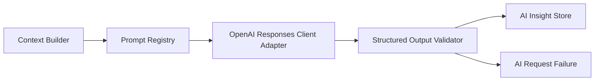

# AI Sidecar Architecture

## 요약

AI Sidecar는 `suseok-trader-v2`의 read-only 분석 보조자다. 시장 context, candidate block, no-trade session, trade review, ops incident, Codex prompt draft를 운영자가 이해하기 쉽게 정리한다. AI Sidecar는 매매 주체가 아니며 `OrderIntent`, `GatewayCommand`, `send_order`, `cancel_order`, `modify_order`를 만들거나 호출하지 않는다.

## 위치와 경계

| 영역 | 담당 |
| --- | --- |
| Core | configuration, API routing, storage initialization, system status |
| Strategy | deterministic candidate setup observation |
| Risk | deterministic risk observation |
| OMS | DRY_RUN 내부 회계 또는 future order lifecycle |
| Gateway | broker transport isolation |
| AI Sidecar | context, structured insight, RCA, review, Codex prompt draft |

AI Sidecar는 Strategy/Risk/OMS decision path 밖에 있다. Output은 Dashboard, Report, Operator Review, Codex Prompt Draft surface에만 표시된다.

## Read-only 원칙

- Sidecar output은 Strategy threshold, Risk limit, trading mode, live flag, position size를 바꾸지 않는다.
- Sidecar output은 order enqueue, submit, cancel, modify를 하지 않는다.
- Sidecar output은 Strategy/Risk/OMS 자동 입력이 아니다.
- 모든 output은 schema validation과 safety policy validation을 통과해야 insight로 저장된다.
- validation 실패는 `AI_OUTPUT_INVALID` 같은 실패 상태로 기록될 수 있지만 정상 insight가 아니다.
- 기본 posture는 disabled다.

## Context Builder

PR AI-1은 `AISidecarContextPacket`과 Context Builder를 추가한다. 이것은 OpenAI client가 아니다. 운영자가 AI에게 넘기기 전 정리된 입력자료를 만들 뿐이다.

Context packet은 다음을 적용한다.

- size limit
- secret/path/account redaction
- order-context restriction
- deterministic hash
- schema version

`persist=true`는 packet을 `ai_context_packets`에 audit용으로 저장한다.

## Structured Execution Flow

실행 흐름:

1. deterministic service가 market/candidate/risk/OMS/Gateway/ops state를 저장한다.
2. Context Builder가 allowed task용 read-only packet을 만든다.
3. Prompt Registry가 redacted payload로 prompt를 만든다.
4. OpenAI Responses client가 strict JSON Schema metadata를 보낸다.
5. runner가 model output을 local schema와 domain policy로 검증한다.
6. valid insight만 read-only display용으로 저장한다.
7. invalid/timeout/error는 insight 없이 failure로 기록한다.

이 path는 manual-only다. background worker, Dashboard run button, Strategy/Risk/OMS mutation 연결이 없다.

## Output Surface

| Surface | 의미 | 금지 |
| --- | --- | --- |
| Dashboard Cards | 저장된 insight/report/error 표시 | 실행 버튼 |
| RCA Report | deterministic report와 optional AI summary | 주문 판단 |
| Operator Review | 사람이 읽는 점검 자료 | 자동 정책 변경 |
| Codex Prompt Draft | 사람이 복사하는 프롬프트 초안 | 자동 code change, branch, commit, push, PR |
| LIVE_SIM Review | simulation activity 복기 | retry/cancel/modify/order input |

## OpenAI Client Availability

OpenAI client는 다음 조건이 모두 맞을 때만 available이다.

- `AI_SIDECAR_ENABLED=true`
- `AI_SIDECAR_MODEL` non-empty
- `AI_SIDECAR_OPENAI_API_KEY_ENV`가 가리키는 env var 존재
- optional OpenAI SDK import 성공
- Responses API와 structured output enabled
- tools/function calling disabled
- order tools disabled

API key나 SDK가 없어도 Core startup, tests, `/health`, `/api/status`, context preview는 동작해야 한다.

## Disabled Tools

PR AI-2는 다음을 사용하지 않는다.

- OpenAI tools/function calling
- web search
- code interpreter
- MCP tool integration
- order-related tool

## 운영자 체크포인트

- AI 결과는 분석 보조 자료다.
- AI/RCA/Codex output은 Strategy/Risk/OMS 자동 입력이 아니다.
- AI 실패는 Core 상태 조회를 깨지 않아야 한다.
- AI가 만든 문구에 주문 관련 표현이 있어도 실행 field로 저장되면 안 된다.
